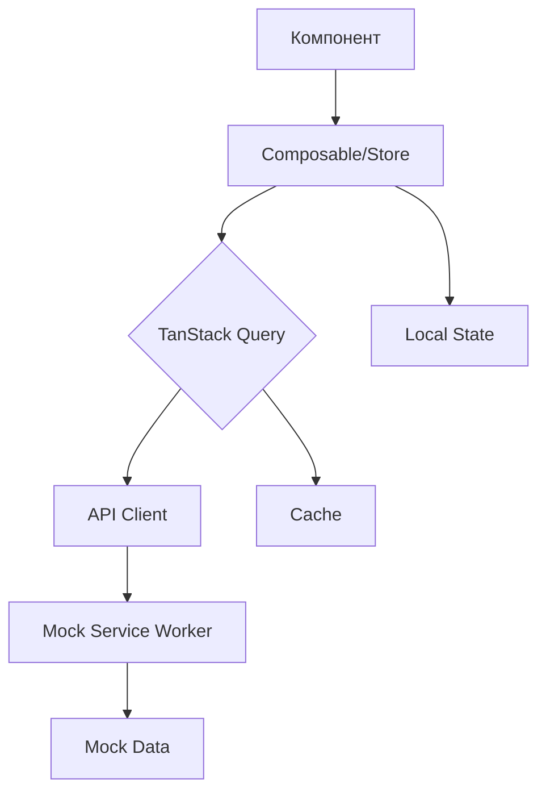

# Техническое задание на разработку Headless E-commerce Dashboard

## 1. Общие положения

### 1.1. Назначение документа
Настоящее техническое задание определяет требования к разработке Headless E-commerce Dashboard — административной панели управления интернет-магазином с архитектурой, отвязанной от конкретного бэкенда.

### 1.2. Цель проекта
Создание современного, масштабируемого административного интерфейса для демонстрации навыков frontend-разработки с полным циклом разработки — от UI/UX до интеграции с внешними API.

### 1.3. Целевая аудитория
- Рекрутеры и технические специалисты при оценке портфолио
- Разработчики для изучения кодовой базы
- Потенциальные работодатели для оценки уровня навыков

## 2. Технологический стек

### 2.1. Основные технологии
| Компонент | Технология | Версия | Назначение |
|-----------|------------|---------|------------|
| Фреймворк | Vue 3 | 3.4+ | Основной фреймворк |
| Язык | TypeScript | 5.0+ | Типизация |
| State Management | Pinia | 2.1+ | Управление состоянием |
| API клиент | TanStack Query | 5.0+ | Кэширование и синхронизация |
| Стили | Tailwind CSS | 3.3+ | Утилитарные стили |
| UI компоненты | Headless UI | 1.7+ | Доступные компоненты |
| Валидация | Zod | 3.22+ | Валидация схем |
| Иконки | Lucide Vue | 0.3+ | Иконки |
| Графики | Chart.js + Vue-Chartjs | 5.0+/5.0+ | Визуализация данных |
| Маршрутизация | Vue Router | 4.2+ | Навигация |
| Реальное время | WebSocket | - | Уведомления |
| Тестирование | Vitest | 1.0+ | Unit-тесты |
| E2E тесты | Playwright | 1.40+ | End-to-end тесты |
| Контейнеризация | Docker | 24.0+ | Развертывание |
| CI/CD | GitHub Actions | - | Автоматизация |

### 2.2. Вспомогательные инструменты
- **ESLint** + **Prettier** — линтинг и форматирование
- **Husky** + **lint-staged** — pre-commit хуки
- **Vite** — сборка и dev server
- **MSW (Mock Service Worker)** — мокирование API
- **Day.js** — работа с датами
- **VueUse** — полезные композиции

## 3. Функциональные требования

### 3.1. Модуль товаров (Products)
#### 3.1.1. CRUD операции
- Создание нового товара с валидацией полей
- Просмотр списка товаров с пагинацией
- Редактирование существующих товаров
- Удаление товаров с подтверждением
- Массовые операции (выделение нескольких товаров)

#### 3.1.2. Функциональность
- Фильтрация по категориям, статусу, цене
- Поиск по названию, описанию, SKU
- Сортировка по различным параметрам
- Загрузка изображений (drag & drop)
- Управление инвентарем (остатки на складе)
- Экспорт данных в CSV/JSON

### 3.2. Панель аналитики (Analytics)
#### 3.2.1. Графики и метрики
- **Объем продаж по времени** (линейный график)
- **Популярные товары** (столбчатая диаграмма)
- **География продаж** (карта/круговая диаграмма)
- **Конверсия** (индикатор с трендом)
- **Средний чек** (динамика изменения)

#### 3.2.2. Функциональность
- Выбор периода (день/неделя/месяц/квартал/год)
- Сравнение периодов
- Фильтрация по категориям товаров
- Экспорт отчетов
- KPI панель с ключевыми метриками

### 3.3. Управление заказами (Orders)
#### 3.3.1. Канбан-доска
- Drag & drop перемещение между статусами:
  - Новый → В обработке → Выполнен → Отменен
- Просмотр деталей заказа
- История изменений статуса

#### 3.3.2. Функциональность
- Поиск заказов по ID, клиенту, дате
- Фильтрация по статусу, сумме, каналу продаж
- Массовое обновление статусов
- Уведомления о новых заказах (real-time)
- Печать счетов/накладных

### 3.4. Система уведомлений
- Real-time уведомления через WebSocket
- Toast-уведомления о событиях
- Центр уведомлений с историей
- Настройка типов уведомлений
- Звуковые оповещения (опционально)

### 3.5. Общие функции
#### 3.5.1. Аутентификация и авторизация
- Mock-авторизация (без реального бэкенда)
- Роли пользователей (админ/менеджер)
- Защищенные маршруты

#### 3.5.2. Интернационализация (i18n)
- Поддержка русского и английского языков
- Динамическое переключение языка
- Форматирование дат, валют, чисел

#### 3.5.3. Темы оформления
- Светлая и темная темы
- Переключение без перезагрузки
- Сохранение выбора темы

#### 3.5.4. Адаптивность
- Desktop-first подход
- Адаптация под планшеты (768px+)
- Базовая поддержка мобильных устройств

## 4. Нефункциональные требования

### 4.1. Производительность
- Первая загрузка страницы < 2 секунд
- Time to Interactive < 3 секунд
- Lighthouse score > 90 для Performance
- Оптимизация бандла (code splitting, lazy loading)

### 4.2. Качество кода
- Покрытие unit-тестами > 80% критических модулей
- E2E тесты для основных пользовательских сценариев
- Статическая типизация (TypeScript strict mode)
- Отсутствие ошибок в консоли браузера

### 4.3. UX/UI требования
- Соответствие принципам Material Design или аналогичным
- Доступность (WCAG AA уровень)
- Минимальная задержка при взаимодействии (< 100ms)
- Плавные анимации переходов

### 4.4. Безопасность
- Валидация всех входных данных
- Защита от XSS атак
- Безопасная обработка ошибок
- HTTP-only куки для аутентификации

## 5. Архитектура системы

### 5.1. Структура проекта
```
src/
├── api/                    # Слой работы с API
│   ├── clients/           # HTTP клиенты
│   ├── endpoints/         # Эндпоинты API
│   ├── mocks/            # Моки для разработки
│   └── websocket/        # WebSocket соединение
├── assets/               # Статические ресурсы
├── components/           # Vue компоненты
│   ├── common/          # Общие компоненты
│   ├── layout/          # Компоненты лейаута
│   ├── products/        # Компоненты модуля товаров
│   ├── analytics/       # Компоненты аналитики
│   └── orders/          # Компоненты заказов
├── composables/          # Vue composables
├── layouts/              # Шаблоны страниц
├── locales/              # Файлы перевода
├── router/               # Конфигурация маршрутизации
├── stores/               # Pinia хранилища
├── styles/               # Глобальные стили
├── types/                # TypeScript типы
├── utils/                # Вспомогательные функции
└── views/                # Страницы приложения
```

### 5.2. Data Flow


### 5.3. State Management Strategy
- **TanStack Query** — для server state (данные с API)
- **Pinia** — для client state (UI состояние, формы)
- **Local Storage** — для персистентных данных (тема, язык)

## 6. API спецификация

### 6.1. Модели данных
```typescript
// Пример модели товара
interface Product {
  id: string;
  name: string;
  description: string;
  price: number;
  currency: string;
  category: string;
  sku: string;
  stock: number;
  images: string[];
  status: 'active' | 'draft' | 'archived';
  createdAt: string;
  updatedAt: string;
}

// Пример модели заказа
interface Order {
  id: string;
  customer: Customer;
  items: OrderItem[];
  total: number;
  status: 'new' | 'processing' | 'completed' | 'cancelled';
  paymentStatus: 'pending' | 'paid' | 'failed';
  shippingAddress: Address;
  createdAt: string;
}
```

### 6.2. Эндпоинты
```
GET    /api/products        # Список товаров
GET    /api/products/:id    # Детали товара
POST   /api/products        # Создание товара
PUT    /api/products/:id    # Обновление товара
DELETE /api/products/:id    # Удаление товара

GET    /api/orders          # Список заказов
GET    /api/orders/:id      # Детали заказа
PUT    /api/orders/:id/status # Обновление статуса

GET    /api/analytics/sales # Данные для графиков
GET    /api/analytics/kpi   # Ключевые метрики

WS     /ws/notifications    # WebSocket для уведомлений
```

## 7. Тестирование

### 7.1. Unit тесты (Vitest)
- Тестирование компонентов с Testing Library
- Тестирование composables и утилит
- Тестирование хранилищ Pinia
- Мокирование зависимостей

### 7.2. E2E тесты (Playwright)
- Критический путь: авторизация → создание товара → просмотр
- Тестирование модуля заказов
- Тестирование фильтров и поиска
- Скриншотное тестирование

### 7.3. Интеграционное тестирование
- Тестирование работы с API
- Тестирование WebSocket соединения
- Тестирование работы с localStorage

## 8. Деплой и инфраструктура

### 8.1. Docker конфигурация
```dockerfile
# Dockerfile
FROM node:20-alpine as builder
WORKDIR /app
COPY package*.json ./
RUN npm ci
COPY . .
RUN npm run build

FROM nginx:alpine
COPY --from=builder /app/dist /usr/share/nginx/html
COPY nginx.conf /etc/nginx/conf.d/default.conf
EXPOSE 80
CMD ["nginx", "-g", "daemon off;"]
```

### 8.2. CI/CD Pipeline (GitHub Actions)
```yaml
# .github/workflows/ci.yml
name: CI/CD Pipeline
on: [push, pull_request]

jobs:
  test:
    runs-on: ubuntu-latest
    steps:
      - uses: actions/checkout@v4
      - uses: actions/setup-node@v4
      - run: npm ci
      - run: npm run lint
      - run: npm run test:unit
      - run: npm run test:e2e
      
  deploy:
    needs: test
    if: github.ref == 'refs/heads/main'
    runs-on: ubuntu-latest
    steps:
      - uses: actions/checkout@v4
      - uses: docker/setup-buildx-action@v2
      - uses: docker/build-push-action@v4
        with:
          push: true
          tags: user/app:latest
```

### 8.3. Хостинг
- **Основной**: Vercel/Netlify для фронтенда
- **Резервный**: GitHub Pages
- **Демо-версия**: доступна по публичной ссылке

## 9. Документация

### 9.1. Техническая документация
- README.md с инструкцией по запуску
- API документация (OpenAPI/Swagger)
- Комментарии в коде (JSDoc)
- Architecture Decision Records (ADR)

### 9.2. Пользовательская документация
- Руководство по установке и настройке
- Описание функциональности
- FAQ по распространенным проблемам

## 10. Критерии приемки

### 10.1. Функциональные критерии
- [ ] Все модули реализованы согласно требованиям
- [ ] Реализован полный CRUD для товаров и заказов
- [ ] Графики аналитики отображают корректные данные
- [ ] WebSocket уведомления работают в реальном времени
- [ ] Поддержка i18n и тем оформления

### 10.2. Технические критерии
- [ ] Проект собирается без ошибок
- [ ] Проходят все тесты (unit, e2e)
- [ ] Lighthouse score соответствует требованиям
- [ ] Код покрыт TypeScript типами
- [ ] Реализована lazy loading маршрутов

### 10.3. Качественные критерии
- [ ] Чистая архитектура и разделение ответственности
- [ ] Отсутствие копипасты, использование переиспользуемых компонентов
- [ ] Оптимизированная производительность
- [ ] Реализована обработка ошибок
- [ ] Удобный и интуитивный интерфейс

## 11. План разработки

### 11.1. Этап 1: Подготовка (3 дня)
- Инициализация проекта
- Настройка инструментов
- Базовая архитектура

### 11.2. Этап 2: Ядро системы (5 дней)
- Система аутентизации
- Базовый layout
- Маршрутизация
- Тема и i18n

### 11.3. Этап 3: Модуль товаров (4 дня)
- CRUD операции
- Фильтры и поиск
- Загрузка изображений

### 11.4. Этап 4: Аналитика (4 дня)
- Графики и диаграммы
- Фильтры по периодам
- KPI панель

### 11.5. Этап 5: Заказы и уведомления (4 дня)
- Канбан-доска
- WebSocket уведомления
- История заказов

### 11.6. Этап 6: Тестирование и деплой (3 дня)
- Написание тестов
- Оптимизация производительности
- Деплой и документация

## 12. Ограничения и допущения

### 12.1. Ограничения
- Проект является демонстрационным, не предназначен для продакшена
- Нет реальной базы данных, используются моки
- Нет реальной аутентификации (mock auth)
- Оптимизирован под современные браузеры

### 12.2. Допущения
- API совместимо с большинством headless commerce систем
- Дизайн следует современным тенденциям
- Кодовая база может быть расширена для реального использования

